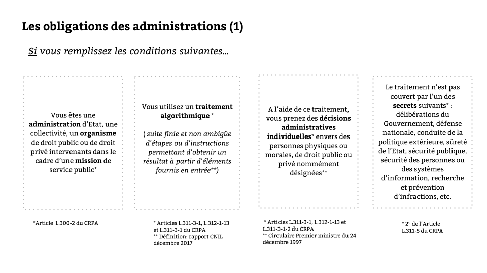
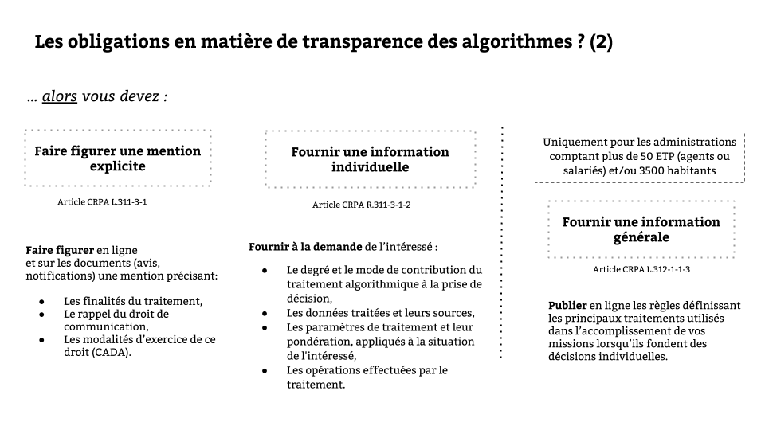
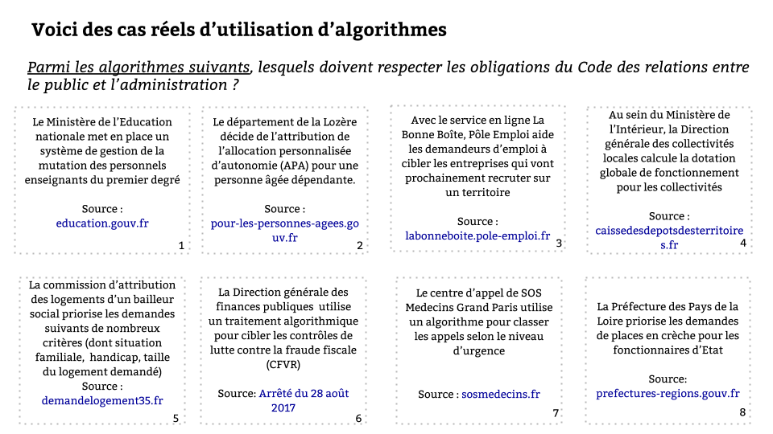

# Les algorithmes publics : enjeux et obligations

Le département [Etalab](https://www.etalab.gouv.fr) accompagne les administrations dans l'application du nouveau cadre juridique sur les algorithmes publics.
Ce guide, ouvert aux contributions, est composé de trois parties qui peuvent se lire de manière indépendante.
- La première partie donne des **éléments de contexte**: qu'est-ce qu'un algorithme ? à quoi servent les algorithmes dans le secteur public ? 
- La seconde partie détaille les **enjeux en termes d'éthique et de responsabilité**, 
- La troisième partie présente le **cadre juridique applicable** en matière de transparence des algorithmes notamment suite à l'adoption de la loi pour une République numérique.

📎 Etalab propose par ailleurs d'autres ressources en lien avec ce sujet, notamment un [guide sur l'ouverture des codes sources](https://github.com/etalab/ouverture-des-codes-sources-publics).

### À qui est-il destiné ?

Ce guide est destiné à l'ensemble des administrations et organisations chargées d'une mission de service public qui conçoivent, développent et opèrent des traitements algorithmiques.

### Comment contribuer ?

Ce document est un outil évolutif et ouvert. Vous pouvez contribuer à l'améliorer en proposant une modification dans la [version éditable](0-guide.md) du guide (sur GitHub) ou en contactant directement Simon Chignard (département Etalab - Direction interministérielle du numérique): `simon.chignard@data.gouv.fr` et l'équipe en charge des algorithmes publics : `algorithmes@etalab.gouv.fr`.  

## 1- A quoi servent les algorithmes publics ?

Commençons tout d'abord par une définition: **qu'est-ce qu'un algorithme** ? 
> Selon le Larousse, un algorithme est un "*ensemble de règles opératoires dont l'application permet de résoudre un problème énoncé au moyen d'un nombre fini d'opérations. Un algorithme peut être traduit, grâce à un langage de programmation, en un programme exécutable par un ordinateur*".

📍 Retenons que, selon cette définition, un algorithme peut donc exister **indépendamment d'un traitement informatique**. Une grille de notation "papier" utilisée par une administration peut donc être considérée comme un algorithme.

La CNIL définit un algorithme comme _"une suite finie et non ambigüe d’instructions permettant d’aboutir à un résultat à partir de données fournies en entrée."_ (rapport ["Comment permettre à l'Homme de garder la main ? Les enjeux éthiques des algorithmes et de l'intelligence artificielle", décembre 2017]((https://www.cnil.fr/sites/default/files/atoms/files/cnil_rapport_garder_la_main_web.pdf)))

Nous avons recensé plusieurs types d'**usages des algorithmes** dans les administrations, avec une série d'exemples associés.

| Usages      | Exemples |
| ----------- | ----------- |
| Attribuer des droits, calculer des montants selon des règles prédéfinies| Calcul des taxes et des impôts, attribution de prestations sociales, ... |
| Réaliser un appariement entre une "offre" et une "demande"   | Gestion de la mobilité des agents (RH), accès à l'enseignement supérieur (Parcoursup), attribution de places en crèches, ... |
| Prédire une situation ou un risque en analysant des données  | Prédire un risque de défaillance d'une entreprise (Signaux Faibles), cibler les contrôles de lutte contre la fraude fiscale, ...        |
| Aider à la décision des usagers | Aider les demandeurs d'emploi à cibler leurs candidatures spontanées (La Bonne Boîte), simuler le coût d'une embauche, ...        |

### Décision automatisée ou aide à la décision ?

Certains algorithmes peuvent être utilisés pour prendre des décisions. On les distingue selon le **degré d'intervention humaine** dans cette prise de décision: 
- Certains fonctionnent sans intervention humaine (par exemple le calcul de l'impôt des 37 millions de foyers fiscaux). On parle alors de **traitement automatisé** ou de **décision automatisée**.

- D'autres sont des outils d'**aide à la décision**: ils aident l'humain à prendre une décision, par exemple en classant des dossiers selon des critères de priorité pour qu'ils soient ensuite étudiés par une commission qui prendra formellement la décision.

Nous reviendrons sur cette distinction dans la troisième partie de ce guide consacrée au cadre juridique applicable.

## 2 - Les enjeux des algorithmes publics

### Algorithmes du secteur public vs. algorithmes du secteur privé

Tout le monde a entendu parler des algorithmes utilisés par les grandes entreprises du numérique. Citons quelques exemples: 
- le **PageRank** du moteur de recherche Google qui détermine les pages de résultats pour une requête,
- le **Newsfeed** qui détermine le contenu d'un fil d'actualités Facebook,
- l'**algorithme de tarification dynamique** d'Uber qui fait varier les prix des courses en fonction de la demande, 
- ...

Par rapport aux algorithmes mis en oeuvre par le secteur privé, les algorithmes publics ont des caractéristiques particulières: 
1. Ils sont censés **opérer au service de l'intérêt général**,
2. Ils servent souvent à **exécuter le droit**, à (faire) appliquer la loi,
3. Ils sont bien souvent **incontournables**, c'est à dire qu'il n'existe pas d'alternatives pour les usagers.

📍En ce sens, les algorithmes publics sont des formes de l'action publique et sont à ce titre soumis à la même forme d'exigence de redevabilité. Les administrations qui conçoivent et utilisent des algorithmes publics doivent donc "rendre des comptes" de leur utilisation auprès des individus concernés, mais aussi de la société dans son ensemble.

### Comment les administrations peuvent-elles "rendre des comptes" sur l'usage des algorithmes publics ?

Ce ne sont pas tant les algorithmes eux-mêmes que les administrations qui les mettent en oeuvre qui doivent rendre des comptes. On parle de **principe de redevabilité**. Concrètement cela signifie: 
- **signaler**, en indiquant quand un algorithme est utilisé,
- **décrire**, en précisant le fonctionnement général de l'algorithme,
- **justifier**, en expliquant les objectifs poursuivis et les raisons du recours à cet algorithme,
- **expliquer ses effets**, en expliquant un résultat individuel mais aussi en précisant les impacts généraux et particuliers,
- **rendre accessible**, en publiant le code source et la documentation associée,
- **permettre la contestation**, en indiquant les voies de recours possibles.

Il faut noter que plusieurs manières de rendre des comptes (se signaler, décrire, justifier, expliquer, ...) correspondent à des **obligations légales** introduites par la loi pour une République numérique ou plus récemment le Règlement général sur la protection des données (RGPD). La troisième partie de ce document présente le cadre juridique applicable.

### Comment rendre des décisions "justes" à l'aide des algorithmes ? ##

La prise de décision (automatisée ou non) constitue l'un des principaux usages des algorithmes dans le secteur public - par exemple pour déterminer le droit à une aide sociale ou encore gérer la mobilité des enseignants. 
Nous nous intéressons ici au **principe de justice**: quelles sont les conditions requises pour qu'un individu concerné par la décision la juge "juste" ? 

Nous avons identifié dans la [littérature scientifique](https://arxiv.org/pdf/1801.10408.pdf) **quatre critères** à respecter pour qu'une décision prise à l'aide d'un algorithme soit considérée comme juste: 
- la **transparence**: il faut que la procédure soit décrite,
- l'**intelligibilité**: il faut que la procédure soit compréhensible par les intéressés,
- la **loyauté**: il faut que la procédure décrite soit effectivement utilisée de manière complète et fidèle,
- l'**égalité de traitement**: il faut qu'aucun individu n'ait fait l'objet d'un traitement plus favorable (ou défavorable) que les autres individus concernés.

📍On notera qu'un individu peut tout à fait considérer comme juste une décision qui ne lui est pas favorable (si par exemple la décision consiste à lui refuser une indemnité car il n'est pas éligible selon les critères fixés par la loi).

## 3 - Le cadre juridique applicable

La loi pour une République numérique, et plus récemment le Règlement sur la protection des données à caractère personnel (RGPD) ont introduit de nouvelles dispositions concernant les algorithmes publics. Ces dispositions visent à introduire une **plus grande transparence et** une plus grande **redevabilité** de l'administration dans l'usage de ces systèmes, en particulier quand ils sont utilisés pour prendre des décisions.

On distingue :
* **Les obligations liées au traitement de données personnelles** : [l'article 119 de la loi Informatique et Libertés](https://www.legifrance.gouv.fr/affichTexteArticle.do?idArticle=LEGIARTI000037817721&cidTexte=JORFTEXT000000886460&dateTexte=20190601), qui s'applique tant au secteur public que privé, précise que "toute personne physique justifiant de son identité a le droit d'interroger le responsable d'un traitement à caractère personnel en vue d'obtenir (...) 5° les informations permettant de connaître et de contester la logique qui sous-tend le traitement automatisé en cas de décision prise sur le fondement de celui-ci et produisant des effets juridiques à l'égard de l'intéressé".
* **Les obligations liées à l'ouverture des codes sources** (voir le [guide d'Etalab sur l'ouverture des codes sources de logiciels](https://guides.etalab.gouv.fr/algorithmes/)) ; 
* **Les obligations spécifiques de transparence des algorithmes** prévues par le code des relations entre le public et l'administration (CRPA), qui sont détaillées dans la section suivante.

::: tip En résumé
 Même si un algorithme n'est pas concerné par les obligation de transparence du CRPA, il peut être soumis aux autres obligations précitées.
:::

### Qui est concerné par la transparence des algorithmes ?

Le code des relations entre le public et l'administration (CRPA) précise le périmètre des administrations et des traitements concernés.

📝 **Si**: 
- vous êtes **une administration d’Etat, une collectivité, un organisme de droit public ou de droit privé intervenant dans le cadre d’une mission de service public** [(article L.300-2)](https://www.legifrance.gouv.fr/affichCodeArticle.do?cidTexte=LEGITEXT000031366350&idArticle=LEGIARTI000031367689&dateTexte=&categorieLien=cid),
- vous utilisez un **traitement algorithmique** (cf. la [définition](0-guide.md#1--a-quoi-servent-les-algorithmes-publics-) ci-dessus. Pour rappel, cela inclut les traitements automatisés **et** les outils d'aide à la décision),
- à l’aide de ce traitement, vous prenez des **décisions administratives individuelles envers des personnes physiques ou morales, de droit public ou privé nommément désignées** [(article L311-3-1)](https://www.legifrance.gouv.fr/affichCodeArticle.do;jsessionid=21CA8A3C6491AED0CE70B15139E716A3.tplgfr27s_2?idArticle=LEGIARTI000033205535&cidTexte=LEGITEXT000031366350&dateTexte=20200826),
- et que ce traitement n’est **pas couvert par l’un des secrets définis par la loi** [(2° de l'article L.311-5)](https://www.legifrance.gouv.fr/affichCodeArticle.do?cidTexte=LEGITEXT000031366350&idArticle=LEGIARTI000031367708), et notamment: délibérations du Gouvernement, défense nationale, conduite de la politique extérieure, sûreté de l’Etat, sécurité publique, sécurité des personnes ou des systèmes d’information, recherche et prévention d’infractions, etc. 

**Alors** vous devez remplir les nouvelles obligations liées à la **transparence des algorithmes**.

::: tip La décision administrative individuelle

📍On notera que les décisions administratives "individuelles" ne concernent pas uniquement des personnes physiques mais aussi **les personnes morales** pour la définition de décision administrative individuelle). C'est à dire qu'une décision prise par une administration envers une association, une entreprise ou un autre acteur public à l'aide d'un traitement algorithmique sera aussi concernée par ces obligations. 

L'[article L200-1 du CRPA](https://www.legifrance.gouv.fr/affichCodeArticle.do?idArticle=LEGIARTI000031367495&cidTexte=LEGITEXT000031366350&dateTexte=20160101) et [la circulaire du 24 décembre 1997 relative à la mise en oeuvre de la déconcentration des décisions administratives individuelles](https://www.legifrance.gouv.fr/affichTexte.do?cidTexte=JORFTEXT000000752779&categorieLien=id#:~:text=Le%20d%C3%A9cret%20du%2015%20janvier%201997%20autorise%20la%20d%C3%A9concentration%20de,autorit%C3%A9s%20autres%20que%20le%20pr%C3%A9fet.&text=%2D%20ces%20exceptions%20doivent%20avoir%20%C3%A9t%C3%A9,24%20d%C3%A9cembre%201997%20(2).) détaillent les caractéristiques des décisions administratives individuelles. 

:::

### Quelles sont ces obligations en matière de transparence ?

📝Le Code des relations entre le public et l'administration définit 3 obligations: 
1. fournir une **information générale** ([article L.312-1-3](https://www.legifrance.gouv.fr/affichCodeArticle.do?cidTexte=LEGITEXT000031366350&idArticle=LEGIARTI000033205516&dateTexte=&categorieLien=id)) 
2. faire figurer une **mention explicite** ([article L.311-3-1](https://www.legifrance.gouv.fr/affichCodeArticle.do?cidTexte=LEGITEXT000031366350&idArticle=LEGIARTI000033205535&dateTexte=&categorieLien=cid))
3. **fournir une information individuelle à la demande** de l'intéressé ([article L.311-3-1-2](https://www.legifrance.gouv.fr/affichCodeArticle.do?cidTexte=LEGITEXT000031366350&idArticle=LEGIARTI000034195881)).

📍A noter que l'obligation d'information générale s'applique uniquement aux administrations comptant plus de 50 équivalents temps plein (agents et/ou salariés) et aux collectivités de plus de 3500 habitants. 

Concrètement, si vous remplissez les conditions, alors vous devrez:
- au titre de l'information générale: **publier en ligne** les règles définissant les principaux traitements utilisés dans l’accomplissement de vos missions lorsqu’ils fondent des décisions individuelles,
- au titre de la mention explicite: **faire figurer en ligne et sur les documents** (avis, notifications) une mention précisant les finalités du traitement, le rappel du droit de communication, les modalités d’exercice de ce droit,
- au titre de l'information individuelle: **fournir à la demande de l’intéressé** : le degré et le mode de contribution du traitement algorithmique à la prise de décision, les données traitées et leurs sources, les paramètres de traitement et leur pondération, appliqués à la situation de l'intéressé, les opérations effectuées par le traitement.

### Obligations spécifiques aux traitements automatisés

On notera que ces obligations s'appliquent à l'ensemble des traitements qui fondent des décisions administratives individuelles, **quel que soit le degré d'intervention humaine**. Elles concernent donc aussi bien les traitements automatisés que les outils d'aide à la décision.

📍Le législateur a introduit en 2018 dans la loi dite "Informatique et libertés" ([article 47](https://www.legifrance.gouv.fr/affichTexteArticle.do;jsessionid=5F59E6EC3C4F7E19F0EC2C9163ABB223.tplgfr28s_1?idArticle=LEGIARTI000037823131&cidTexte=JORFTEXT000000886460&categorieLien=id&dateTexte=) de la loi du 6 janvier 1978) une obligation supplémentaire concernant les traitements automatisés (c'est à dire sans intervention humaine): à compter du 1er juillet 2020, tout traitement automatisé devra comporter, **à peine de nullité**, l'obligation de mention explicite. 
Par ailleurs le même article précise que "le responsable du traitement s'assure de la maîtrise du traitement algorithmique et de ses évolutions afin de pouvoir expliquer, **en détail et sous une forme intelligible**, à la personne concernée, la manière dont le traitement a été mis en oeuvre à son égard". Cela implique notamment que les traitements de machine learning qui ne peuvent pas être expliqués peuvent être utilisés uniquement comme des outils d'aide à la décision, en gardant un humain dans la boucle. 

::: tip Ressource
Pour plus de détails sur la mention explicite, vous pouvez consulter la [fiche pratique](4-mention.md) sur le sujet.
::: 

### Un outil pour tester vos connaissances

Nous vous proposons un outil sous la forme d'un quizz pour tester votre connaissance du cadre légal applicable aux algorithmes publics. Nous avons identifié **8 exemples réels d'utilisation d'algorithmes**. 

🧐 Saurez-vous identifier ceux qui, parmi les 8, sont aujourd'hui concernés par les obligations de transparence des algorithmes ?

**Réponses au quiz**

1.Le Ministère de l'Education nationale met en place un système de gestion de la mutation des personnels enseignants du premier degré : oui

2.Le département de la Lozère décide de l'attribution de l'allocation personnalisée d'autonomie (APA) pour une personne âgée dépendante : oui

3.Avec le service en ligne la Bonne Boîte, Pôle Emploi aide les demandeurs d'emploi à cibler les entreprises qui vont prochainement recruter sur un territoire : **non**, car il n'emporte pas de décision de la part de l'administration. C'est un outil utilisé pour orienter. 

4.Au sein du Ministère de l'Intérieur, la Direction générale des collectivités locales calcule la dotation globale de fonctionnement pour les collectivités : oui.  

5.La commission d'attribution des logements d'un bailleur social priorise les demandes suivant de nombreux critères (dont situation familiale, handicap, taille du logement demandé) : oui.

6.La Direction générale des finances publiques utilise un traitement algorithmique pour cibler les contrôles de lutte contre la fraude fiscale (CFVR) : **non**. Ce traitement est couvert par l'un des secrets prévus par la loi (2° de l'article L.311-5 du CRPA) : la recherche et la prévention d'infractions. 

7.Le centre d'appel de SOS Médecins Grand Paris utilise un algorithme pour classer les appels selon le niveau d'urgence : oui. La question pourrait se poser de savoir si SOS Médecins est investi d'une mission de service public. C'est le cas. Par ailleurs, la CADA a rendu un avis sur l'algorithme de tri de la Brigade des Sapeurs pompiers de Paris et du SAMU, considérant qu'il s'agissait bien d'une décision administrative individuelle. 

8.La Préfecture des Pays de la Loire priorise les demandes de places en crèche pour les fonctionnaires d'Etat : oui.

## Les prochaines étapes

La **première action** à mener, en tant qu'administration, est de **recenser les algorithmes** potentiellement concernés par l'obligation de transparence et de redevabilité, et de publier cette liste en la rendant facilement trouvable. 

Le département Etalab est à votre disposition pour vous accompagner dans la mise en oeuvre de ce recensement et plus globalement dans la mise en oeuvre de ces nouvelles obligations. Pour nous contacter : `algorithmes@etalab.gouv.fr. 

Etalab met également à disposition une [fiche pratique](4-mention.md) sur la mention explicite.  
