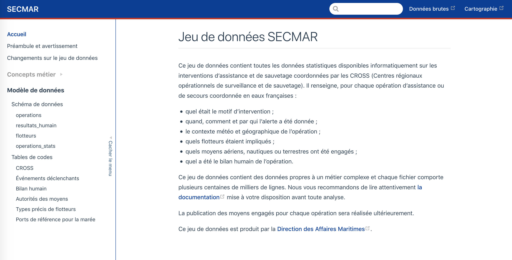
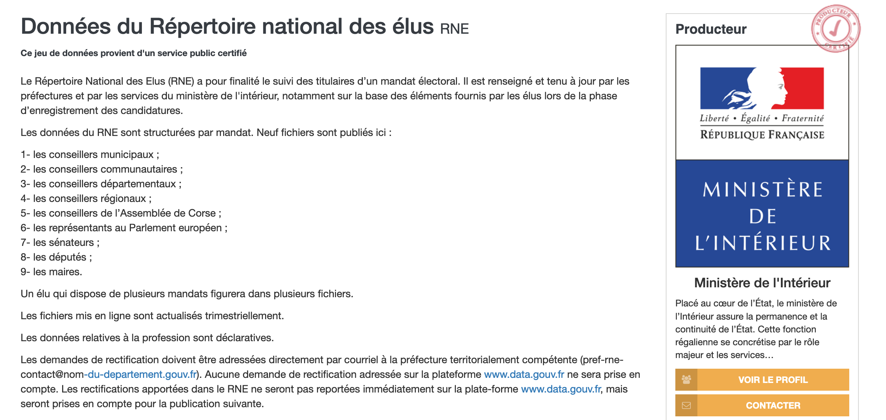
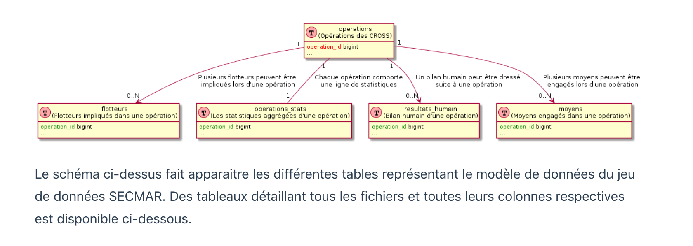
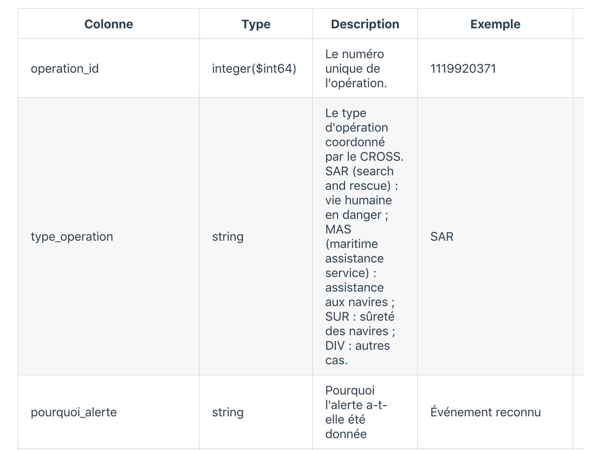
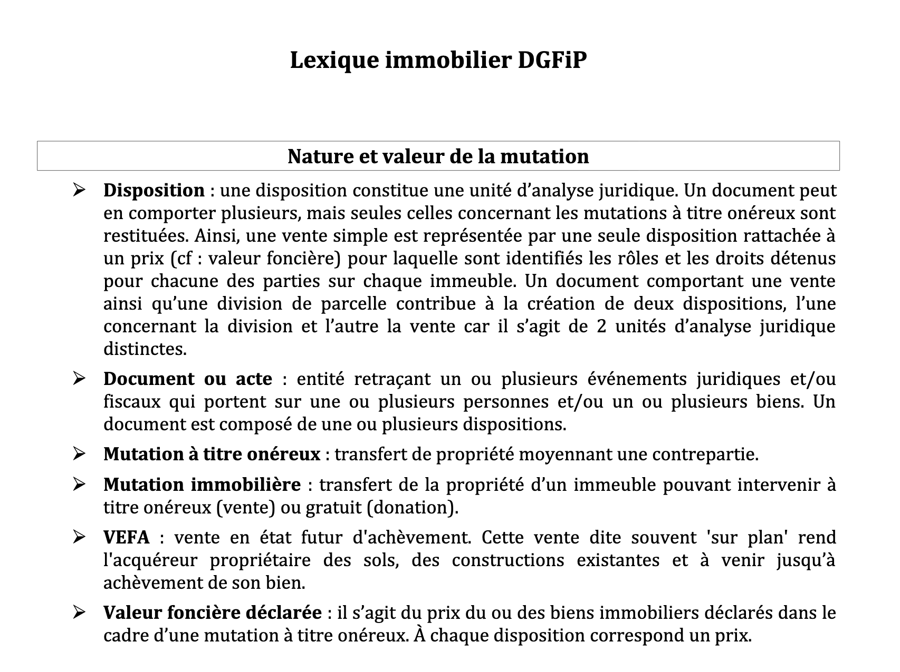
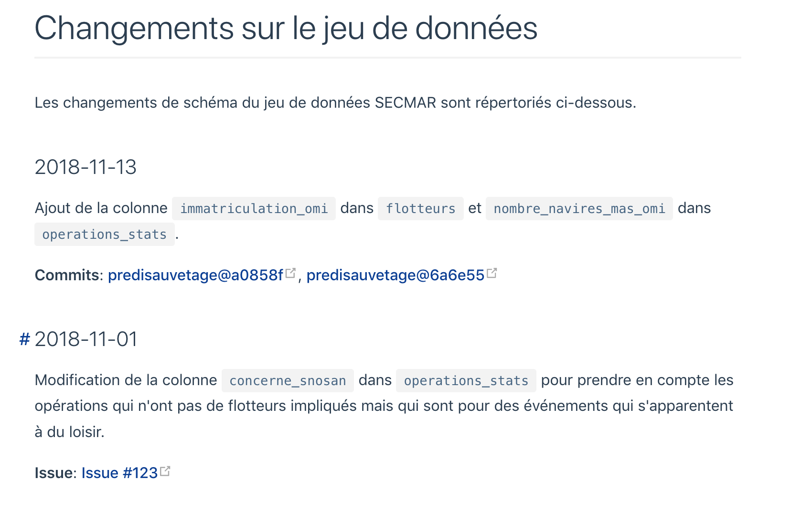

# Documenter les données

[[toc]]

Les données issues de votre organisation ont été produites dans un contexte métier particulier. Un individu externe à l’organisation n’est pas forcément familier avec cet environnement métier, ce qui peut le freiner dans l’exploitation des données diffusées.

La documentation de vos jeux de données a une visée pédagogique et facilite la réutilisation des données. Elle décrit les données et la structure des fichiers publiés.

Il est conseillé de proposer votre documentation en ligne et non sous format PDF. Une documentation en ligne permet de s’assurer que les réutilisateurs des données disposent toujours de la version la plus à jour. Des portails de données, tels que www.data.gouv.fr, proposent des espaces dédiés à la documentation du jeu de données. Vous pouvez également héberger votre documentation sur des sites web statiques. Si le jeu de données a pour vocation de circuler en interne de votre organisation, nous vous conseillons à minima de proposer une documentation dans un fichier séparé aux données. Le fichier contenant les données doit être réservé au à la manipulation de ces dernières. Le fichier contenant la documentation a lui pour vocation d’informer sur la nature des données et sur la structure des fichiers.

>Dans le cadre de la publication des données de sauvetage en mer (opérations coordonnées par les CROSS), un [site statique](https://mtes-mct.github.io/secmar-documentation/) a été créé afin de présenter la documentation du jeu de données.
> 

## Description générale du jeu de données 

Afin de donner un aperçu rapide des informations mises à disposition, il est conseillé de commencer la documentation par une description synthétique du jeu de données.

La description peut couvrir les points suivants :
* Une description générale des données ;
* La liste des fichiers mis à disposition ;
* La description du format des fichiers ;
* La fréquence de mise à jour.

> *Description générale du [jeu de données du Répertoire national des élus](https://www.data.gouv.fr/fr/datasets/repertoire-national-des-elus-1/)*
> 
> *Description générale du jeu de données du Répertoire national des élus*

## Description du mode de production des données 

La structure de votre jeu de données ainsi que son contenu sont intrinsèquement liés au contexte de production des données. La description de cet environnement métier au réutilisateur des données est indispensable :
* Comment ont été produites les données (saisie manuelle, collecte automatique, etc.) ?
* Quels sont les acteurs producteurs des données ? Si les données sont produites par plusieurs acteurs, quel modèle de gouvernance est mis en place pour centraliser les données ?
* Les données sont-elles exhaustives ? Présentent-elles des limites dans leur qualité ?

Il est également conseillé de préciser les points d’attention et précautions d’usage relatifs à la manipulation des données. Certains jeux de données ne peuvent pas être utilisés dans certains contextes, ou possèdent des limitations qui rendent impossible certaines analyses. Par exemple, conformément à  [l’article R112 A-3 du Livre des procédures fiscale](https://www.legifrance.gouv.fr/affichCodeArticle.do?idArticle=LEGIARTI000038001715&cidTexte=LEGITEXT000006069583&dateTexte=20181231), la réutilisation du jeu de données « [Demandes de valeurs foncières](https://www.data.gouv.fr/fr/datasets/demandes-de-valeurs-foncieres/) » ne peut pas avoir ni pour objet ni pour effet de permettre la  ré-identifications des personnes liés à des transactions immobilières.

À partir de la description du mode de production du jeu de données, le réutilisateur comprend la structure du jeu, la nature des données mais aussi les possibles manques ou incohérences figurant dans le fichier.

## Description du modèle de données 
Le jeu de données que vous mettez à disposition peut se composer de plusieurs éléments liés entre eux. Le modèle de données décrit la structure logique du jeu de données.
Il est conseillé de faire apparaître ce modèle de données à l’aide de schémas et de tableaux. Si votre jeu de données se compose de plusieurs fichiers, il est souhaitable de faire apparaître les relations entre eux.

> [La documentation](https://mtes-mct.github.io/secmar-documentation/schema.html) du jeu de données des opérations de sauvetage en mer décrit le modèle de données utilisé. Ce modèle de données permet de comprendre rapidement les relations qui unissent les différents fichiers du jeu de données.
> 

Si vous publiez des données tabulaires, vous pouvez produire un tableau récapitulatif indiquant, pour chaque colonne :
* le nom de la colonne
* son type de données (entier, chaîne de caractères, nombre décimal etc.)
* la description de la donnée contenue dans cette colonne
* une ou plusieurs valeurs d’exemple.

> La documentation du jeu de données de sauvetage en mer présente un tableau récapitulatif des différentes colonnes. La description des champs permet de faire le lien avec le fichier de données, ce qui facilite la lecture des données.
> 

Les termes employés dans un jeu de données sont propres à un environnement métier. S’il existe des termes complexes ou des énumérations, il est conseillé de faire apparaitre un lexique de ces valeurs.
Cet effort de définition fait gagner un temps considérable au réutilisateur lorsqu’il s’approprie le jeu de données. De plus, le partage de définitions formalisées et uniques permet de prévenir des contre-sens dans l’exploitation des données.

> La base de données de demande de valeur foncière recense l’ensemble des transactions immobilières intervenues au cours des cinq dernières années. Le vocabulaire utilisé dans ce jeu de données est issu d’un environnement administratif, parfois difficile à appréhender. La Direction générale des Finances publiques met à disposition une [documentation](https://static.data.gouv.fr/resources/demande-de-valeurs-foncieres/20190419-091745/notice-descriptive-du-fichier-dvf.pdf)  qui comprend notamment un lexique de définition des termes rencontrés. Ce lexique facilite l’appropriation et la réutilisation des données par des acteurs tiers.
> 

## Description des métadonnées

::: tip Qu’est-ce qu’une métadonnée ?
Une métadonnée est une donnée qui décrit ou définit une autre donnée. Dans la vie courante, l’étiquette d’un produit fournit des informations/métadonnées sur le produit (origine, composition, date de péremption, etc.). Appliqué aux jeux de données, les métadonnées sont des descriptions normalisées du contenu du jeu
:::

Des formats standards de métadonnées existent afin de faciliter leur collecte, leur recherche et leur traitement automatique. La plateforme data.gouv.fr propose un module qui renseigne directement les métadonnées d’un jeu de données. Les métadonnées retenues sont les suivantes :
* Titre
* Sigle
* Description
* Licence
* Fréquence de mise à jour
* Mots clés
* Couverture temporelle
* Couverture spatiale
* Granularité spatiale
* Mode privé

Il est possible de consulter le guide de publication d'un jeu de données sur data.gouv.fr pour avoir des informations complémentaires sur ces métadonées. La description des métadonnées apportera à votre jeu de données une meilleure visibilité sur les catalogues.

## Description des changements majeurs

En pratique, il est souhaitable que le modèle de données et la nature de vos données n’évoluent pas au fil du temps. Toutefois, des changements dans la structure des données, dans le mode de collecte ou dans les dispositions réglementaires peuvent affecter le jeu de données. Dans cette situation, il est conseillé de maintenir une liste de ces changements. Cette liste peut faire figurer la date, la version des données (si vous versionnez vos données) et la nature du changement. Si nécessaire, il est possible d’indiquer des liens, comme par exemple lorsque des changements sont introduits par une modification du code de transformation des données.

> [La documentation](https://mtes-mct.github.io/secmar-documentation/CHANGELOG.html) du jeu de données des sauvetages en mer comporte une section “Changement sur le jeu de données”. Cette section référence les changements du jeu de données en renseignant les informations suivantes :
>* La date du changement
>* La nature du changement
>* Les liens associés au changement
> 

## Points de contact
Les réutilisateurs des données peuvent avoir des questions à propos des fichiers mis à disposition. Il est conseillé de proposer un espace d’échange entre les producteurs et réutilisateurs des données. Il est préférable que cet espace d’échange soit public afin qu’il puisse bénéficier aux personnes qui auraient des questions similaires. De plus, la collecte des retours d’usage permettra d’améliorer votre documentation de manière incrémentale.

## Le score de qualité des métadonnées  

Nous avons mis en place sur [data.gouv.fr](http://data.gouv.fr/) un score de qualité des métadonnées pour répondre principalement aux deux problématiques suivantes :
* D’une part, les réutilisateurs de données peinent à identifier les jeux de données de qualité et à évaluer si tel ou tel jeu de donnée est digne d’intérêt ;
* D’autre part, les producteurs de données ne sont pas suffisamment incités et accompagnés à améliorer la qualité de leurs données.
Ce score est encore en phase d’expérimentation.

Ce tableau a pour vocation de vous aider à comprendre et améliorer votre score :

| Critère | Description |
| --- | --- |
| Description des données | - La description des données est de qualité (la description du jeu de données suffisamment longue).  |
| Mise à jour | - La fréquence de mise à jour est renseignée.
- La fréquence de mise à jour est respectée. |
| Licence | - La licence est renseignée. 
- La licence est ouverte.
Voir la page licence pour plus d’information. |
| Métadonnées des ressources | - Les ressources sont décrites ou présence d’au moins une ressource de type documentation.
- Les ressources sont bien au format déclaré (présence d’au moins une ressource avec un format ouvert déclaré).
 |
| Couverture spatiale | - La couverture spatiale est renseignée.
- La granularité spatiale est renseignée.  |
| Couverture temporelle | - La couverture temporelle des données est renseignée.  |

Le poids de chaque critère sera ajusté en fonction de [vos retours](https://support.data.gouv.fr/particulier/retour-plateforme). De nouveaux critères seront ajoutés progressivement notamment pour intégrer la notion de schéma de données.
